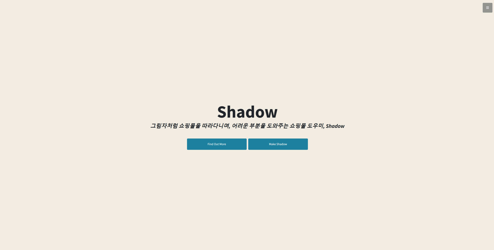
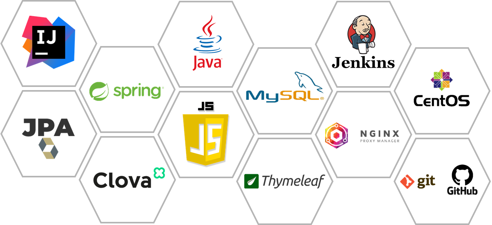
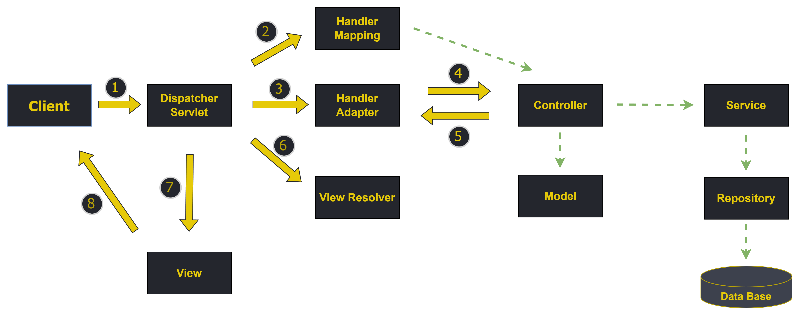
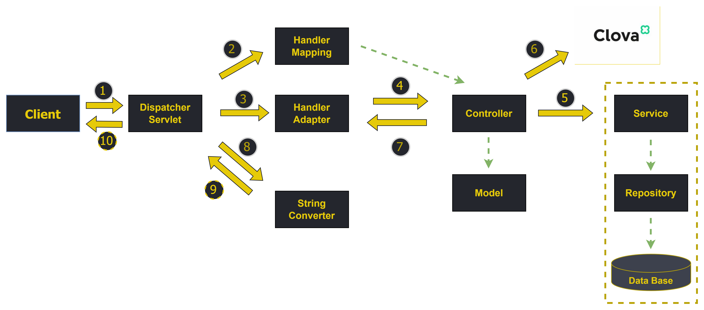
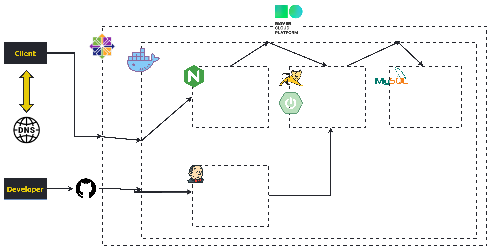
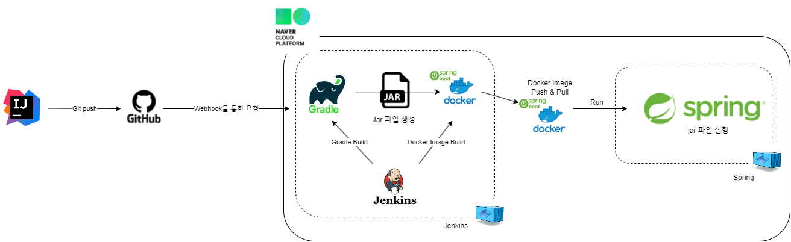

##### 
#### 아이디어 7팀 With us (위드어스)의 프로젝트입니다.

<!-- PROJECT LOGO -->
<br />
<div align="center">
  <a href="https://github.com/likelion-backendschool/Withus">
    
  </a>

<h3 align="center"> SHADOW </h3>

  <p align="center">
    Spring을 활용한 쇼핑몰 도우미 챗봇
    <br />
    <a href="https://shadows.site"><strong>View Demo »</strong></a>
    <br />
    <a href="https://www.notion.so/Shadow-d5a5bf92a2d54ce9952e250b5029ee4b"><strong>View Project Detail »</strong></a>
    <br />
    <a href="https://youtu.be/_5Mzt7pyuLg"><strong>View Video »</strong></a>
    <br />
    <br />

  </p>
</div>

<!-- ABOUT THE PROJECT -->
# 📑 Shadow, 쇼핑몰 도우미

<span style="color:yellow; font-size:150%">
Shadow + you
</span>

#### **배움을 위해 누군가를 "따라가다"**
그림자처럼 쇼핑몰을 따라다니며, 어려운 부분을 도와주는 쇼핑몰 도우미, *Shadow*

<br/>
<p style="text-align:center" align="center">

</p>

* * * 

## 💼 목적
 디지털 소외 계층에 대한 교육이나 도움 서비스의 필요성이 높아짐에 따라, 해당 계층의 편리한 온라인 서비스 기능을 활용하기 위해 인터넷 쇼핑몰의 메뉴를 찾아주고 원하는 요구 사항에 대한 해결 및 활용 방법을 안내하는 Shadow 제작함에 목적이 있다.

* * * 

## ⭕ 기능 요약
* Script를 통해 간편한 챗봇 삽입
* 목적지에 따른, 시나리오, 버튼형 이동 동선 제공
* 현재 위치에 따른, 시나리오 하이라이트 제공
* 사용자 맞춤 챗봇 제작 가능

<p align="right">(<a href="#top">back to top 🔝</a>)</p>

* * * 

## 🛠 Built With
    
<br />

<p style="text-align:center" align="center">

</p>

[//]: # (![techstack.png]&#40;./src/main/resources/static/image/techstack.png&#41;)

<p align="right">(<a href="#top">back to top 🔝</a>)</p>

* * *

## ⚙ Project Structure

* **web MVC Structure (Spring 기본 웹 구성 및 동작과정)**

<br />



* **chat MVC Structure (CHAT <-> 서버 구성 및 동작과정)**

<br />



* **server Structure (Server 구성)**

<br />



* **server Distribute Flow (배포 흐름도)**

<br />



<p align="right">(<a href="#top">back to top 🔝</a>)</p>

* * *

## 💡 **Contributing**

<br />

* **Git Commit 메세지 규약**

```css
feat : 새로운 기능 추가
fix : 버그 수정
docs : 문서 관련
style : 스타일 변경     /* (포매팅 수정, 들여쓰기 추가, …) */
refactor : 코드 리팩토링
test : 테스트 관련 코드
build : 빌드 관련 파일 수정
ci : CI 설정 파일 수정
perf : 성능 개선
chore : 그 외 자잘한 수정
```
<br>

* **Git Branch 규칙**

```css
feature-기능명
/* 예시 */
feature-login
feature-signup
feature-chat-websocket
feature-clova-apigw
```

<p align="right">(<a href="#top">back to top 🔝</a>)</p>

## 👯 Contact& Team

<br />

<div style="text-align:center; margin-left:25%;" align="center">

|  |  |  |  |  |
|:---------------------------------------------------------------------------------------:|:---------------------------------------------------------------------------------------:|:---------------------------------------------------------------------------------------:|:---------------------------------------------------------------------------------------:|:---------------------------------------------------------------------------------------:|
|                           [권재순](https://github.com/jae-soon)                            |                         [김예진](https://github.com/kyj2212)                          |                         [김동현](https://github.com/kimdonghyeon3)                         |                            [박민준](https://github.com/PARKMINJUN)                            |                            [이지원](https://github.com/jiooong)                            |
|                                        back-end                                         |                                        back-end                                         |                                        back-end                                         |                                        back-end                                         |                                        back-end                                         |

</div>

<p align="right">(<a href="#top">back to top 🔝</a>)</p>

* * *

